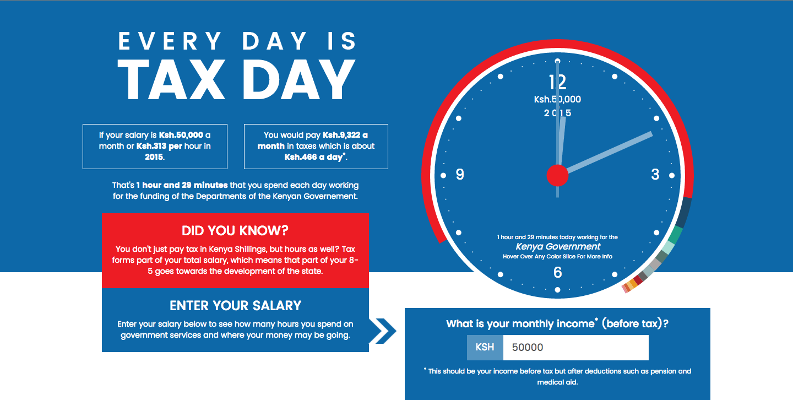

## TaxClock.Kenya



Time is money. So, paying your taxes means that you are actually giving the government your time, or labour. This project helps you calculate exactly how much time you spend working for the government.

Accessible at https://taxclock.pesacheck.org/

### Instances:

- Kenya: [https://taxclock.pesacheck.org/](https://taxclock.pesacheck.org/)
- South Africa: [https://taxclock-za.codeforafrica.org/](https://taxclock-za.codeforafrica.org/)

### Embedding

To embed the TaxClock on your site, place the html code onto your page

```
<script src="https://taxclock.codeforkenya.org/embed.js"/>
```

### Installation:

TaxClock uses [Jekyll](http://jekyllrb.com/).

#### Deploy locally

To run locally, ensure that you are in the parent directory and run the commands below:

```
gem install jekyll bundler
jekyll s
```

#### Deploy to Github Pages

Simply have it on Github and follow the instructions [here](https://pages.github.com/).

#### Deploy to S3

To deploy to S3, we are using the very cool [s3_website gem](https://github.com/laurilehmijoki/s3_website).

Make sure to copy and edit `s3_website.example.yml` as `s3_website.yml` and then;

```
gem install s3_website
s3_website cfg apply
s3_website push 
```

For detailed instructions, check out [s3_website gem](https://github.com/laurilehmijoki/s3_website).

### License

This project helps you calculate exactly how much time you spend working for the government.  
Copyright (C) 2017 Code for Africa

This program is free software: you can redistribute it and/or modify
it under the terms of the GNU General Public License as published by
the Free Software Foundation, either version 3 of the License, or
(at your option) any later version.

This program is distributed in the hope that it will be useful,
but WITHOUT ANY WARRANTY; without even the implied warranty of
MERCHANTABILITY or FITNESS FOR A PARTICULAR PURPOSE.  See the
GNU General Public License for more details.

You should have received a copy of the GNU General Public License
along with this program.  If not, see <https://www.gnu.org/licenses/>.
