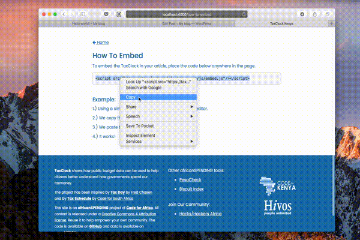
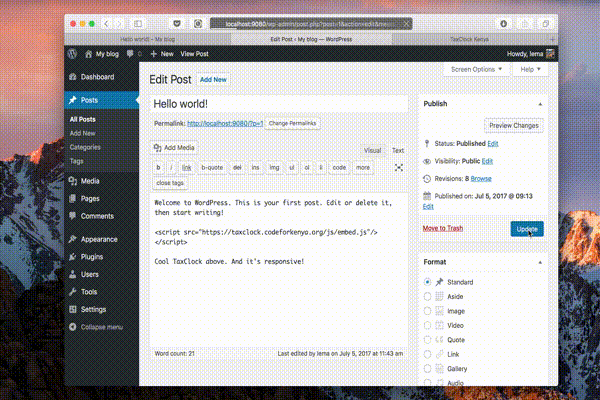

### How To Embed

To embed the TaxClock in your article, place the code below anywhere in the page.

```
<script src="https://taxclock.codeforkenya.org/js/embed.js"/></script>
```

<br/>

#### Example:

1.) Using a simple wordpress website, we go into the editor


<br/>

2.) We copy the code snippet from TaxClock website


<br/>

3.) We paste the code anywhere in our story



<br/>

4.) It works!



<br/>

<a href="screenshot.png" target="_blank"><i class="fa fa-file-image-o"></i> Final screenshot of the example.</a>
